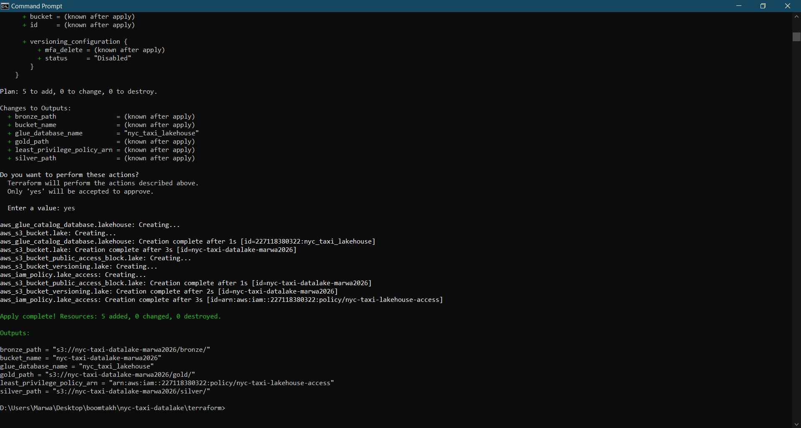
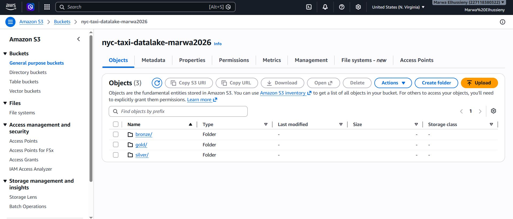
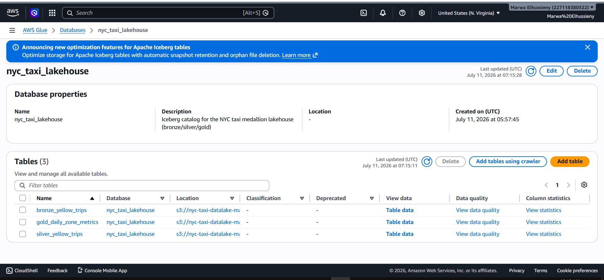
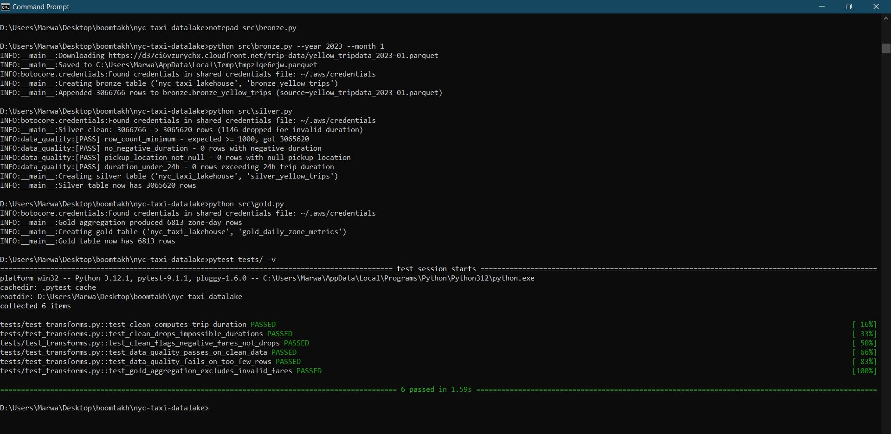
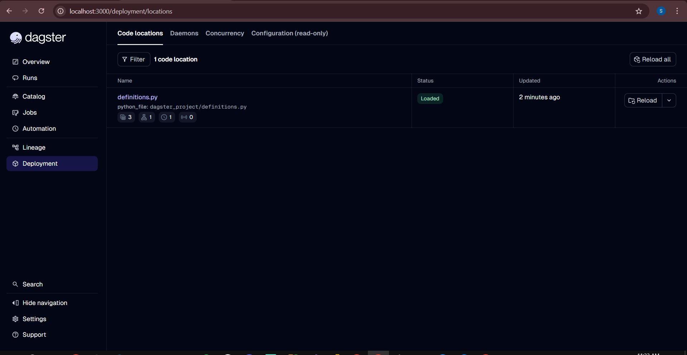
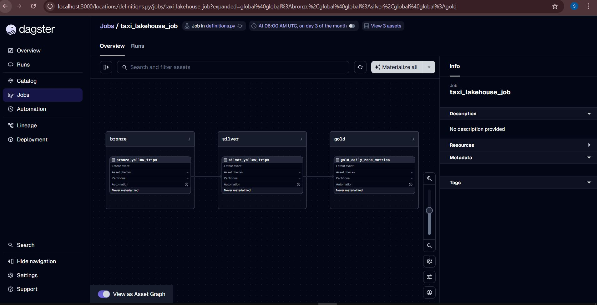
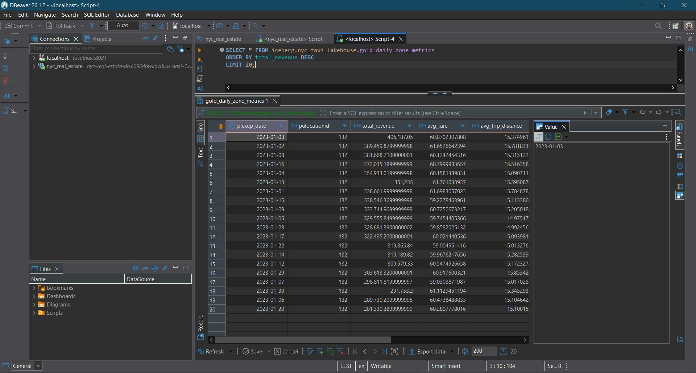

# NYC Taxi Data Lake — Medallion Architecture

A cloud lakehouse built on real NYC TLC Yellow Taxi trip data, using the
Bronze/Silver/Gold (medallion) pattern on Apache Iceberg tables, queryable
via Trino, orchestrated with Dagster, and provisioned with Terraform.

## Why this project

This is the capstone of a 10-project modernized data engineering portfolio.
Where the other projects prove specific skills (IaC, dbt, streaming), this
one demonstrates the pattern most real data platform teams actually run in
production: a lakehouse, not just a warehouse.

- **Iceberg, not raw Parquet.** Tables have schema evolution, ACID writes,
  and time travel — not just files sitting in a bucket.
- **AWS Glue as the catalog**, so there's no separate metastore service to
  operate — Trino and PyIceberg both talk to it directly.
- **Storage/compute separation is real, not theoretical.** Trino runs
  locally in Docker and queries data that physically lives in S3 - exactly
  the pattern that lets a real platform scale query compute independently
  of storage.
- **Data quality gate between silver and gold**, same fail-loud, named-check
  pattern as the other projects in this portfolio - see `src/data_quality.py`.
- **The messy parts of taxi data are handled explicitly**, not glossed over:
  negative fares (refunds/corrections), impossible trip durations, and
  vendor reporting gaps in passenger counts are all called out in
  `src/silver.py` with the reasoning for each decision.

## Architecture

*(Diagram generated separately - see the prompt below if you want to
regenerate or adapt it.)*


<details>
<summary>Prompt used to generate the architecture diagram</summary>

```
Create a clean, professional data engineering architecture diagram in a flat
modern tech-illustration style (like official AWS architecture diagrams).
Horizontal left-to-right flow on a white or light gray background.

Components, left to right:
1. A cloud/download icon labeled "NYC TLC Yellow Taxi Parquet" (monthly public data)
2. An arrow into a dashed rounded rectangle labeled "Dagster - monthly schedule",
   containing three sequential boxes connected by arrows:
   a. "Bronze" (subtitle: raw ingest, Iceberg table)
   b. "Silver" (subtitle: cleaned, quality-gated)
   c. "Gold" (subtitle: daily zone-level aggregates)
3. All three Bronze/Silver/Gold boxes should visually sit on top of or
   overlapping a wide flat shape labeled "Amazon S3" to show they are all
   physically stored there as Iceberg tables
4. A small icon labeled "AWS Glue Catalog" connected to all three
   Bronze/Silver/Gold boxes with thin dotted lines (showing it catalogs all
   three tables, not just one)
5. Below or beside the S3/Glue layer, a separate box labeled "Trino"
   (subtitle: local Docker, SQL queries) with an arrow pointing into it from
   the Gold box, representing query access

Use a professional color palette: gray/tan for the raw source and Bronze box,
teal for Silver, gold/amber for the Gold box (matching its name), and a
distinct purple or dark blue for Trino to show it's a separate query layer.
Include small AWS, Iceberg, and Dagster logos/icons near their respective
components. Clean sans-serif typography, minimal shadows, suitable as a
GitHub README hero image.
```

</details>

## Evidence

Screenshots proving this runs against real, live infrastructure with real NYC TLC data (3M+ trip records), not just written but never executed:

| | |
|---|---|
|  | terraform apply provisioning the S3 bucket and Glue database |
|  | Bronze/silver/gold prefixes in the real S3 bucket |
|  | All 3 Iceberg tables registered in AWS Glue |
|  | Full bronze/silver/gold run (3,066,766 rows ingested, cleaned to 3,065,620, aggregated to 6,813 zone-day rows) plus the full pytest suite passing |
|  | Dagster successfully loading the asset definitions |
|  | bronze to silver to gold pipeline in Dagster, with monthly schedule |
|  | Real SQL query against the gold layer via Trino |

## Dataset

[NYC TLC Yellow Taxi Trip Records](https://www.nyc.gov/site/tlc/about/tlc-trip-record-data.page) —
public monthly Parquet files, millions of rows per month, published with a
~2 month reporting delay by the NYC Taxi and Limousine Commission.

## Stack

| Layer | Tool |
|---|---|
| Table format | Apache Iceberg |
| Catalog | AWS Glue Data Catalog |
| Storage | Amazon S3 |
| Transform engine | PyIceberg + PyArrow (no Spark cluster needed) |
| Query engine | Trino (local Docker) |
| Orchestration | Dagster |
| IaC | Terraform |
| CI | GitHub Actions (pytest + terraform validate) |

## Repo structure

```
├── terraform/              # S3 bucket, Glue database, IAM policy
├── src/
│   ├── catalog.py          # Shared PyIceberg <-> Glue catalog connection
│   ├── bronze.py           # Downloads + ingests raw TLC parquet
│   ├── silver.py           # Cleans, types, quality-gates the data
│   ├── gold.py              # Daily zone-level business aggregates
│   └── data_quality.py     # Named, fail-loud quality checks
├── dagster_project/
│   └── definitions.py      # bronze -> silver -> gold assets + monthly schedule
├── trino/catalog/           # Trino's Iceberg connector config
├── tests/test_transforms.py # pytest suite (runs on synthetic data, no AWS needed)
├── docker-compose.yml       # Local Trino + Dagster dev server
└── .github/workflows/ci.yml
```

## Running it

### 1. Provision the lakehouse infrastructure

```bash
cd terraform
cp terraform.tfvars.example terraform.tfvars
# edit terraform.tfvars: set a globally-unique bucket_name

terraform init
terraform plan
terraform apply
```

### 2. Set environment variables

```bash
export AWS_ACCESS_KEY_ID=...
export AWS_SECRET_ACCESS_KEY=...
export AWS_REGION=us-east-1
export LAKE_BUCKET_NAME=$(terraform -chdir=terraform output -raw bucket_name)
export GLUE_DATABASE_NAME=$(terraform -chdir=terraform output -raw glue_database_name)
```

### 3. Run the pipeline locally

```bash
pip install -r requirements.txt
python src/bronze.py --year 2024 --month 1
python src/silver.py
python src/gold.py
```

### 4. Query it with Trino

```bash
docker compose up trino
```
Then connect (e.g. via the Trino CLI or DBeaver) to `localhost:8080`, catalog
`iceberg`, and query:
```sql
SELECT * FROM iceberg.nyc_taxi_lakehouse.gold_daily_zone_metrics
ORDER BY total_revenue DESC
LIMIT 20;
```

### 5. Or orchestrate with Dagster

```bash
docker compose up dagster
```
Dagster UI at http://localhost:3000 - materialize the assets manually or let
the monthly schedule handle it.

### 6. Tests

```bash
pytest tests/ -v
```

## Tearing down

```bash
cd terraform
terraform destroy
```
Note: `terraform destroy` won't empty a non-empty S3 bucket by default -
empty the bronze/silver/gold prefixes first if you've run the pipeline.

## What I'd add with more time

- Partition the Iceberg tables by pickup date for faster time-range queries
- A proper Athena or Superset dashboard on top of the gold layer
- CDC-style incremental bronze ingestion instead of full monthly batch loads

---
*Part of a modernized 10-project data engineering portfolio, upgrading the
original brief from [garage-education/data-engineering-projects](https://github.com/garage-education/data-engineering-projects).*
